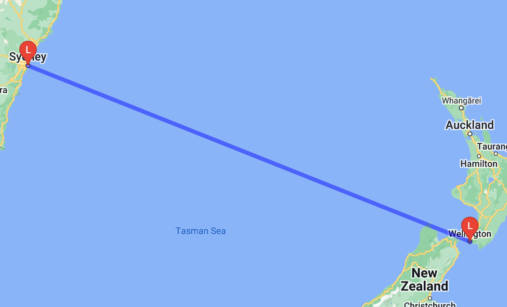

#### Things I learned:

- Wrapping shell commands using `pkgs.writeShellApplication`
- `Submodules`
- The `strMatching` type
- Functions as submodule arguments
- The either and enum types
- The `between` constraint on integer values
- A rough idea of how `evalModules` works, and what it returns
- Importance of explicitly setting `import <nixpkgs> { config = {}; overlays = []; }` for reproducibility
- `concatMap` is a more efficient implementation of `concatLists (map f list)`
- Various bash commands (`entr`, `xargs`)
- Deeper understanding of stdin/out and pipe redirections

#### Command to run

Assuming user has a google api key in `~/.local/share/google-api/key`:

```bash
nix-shell -p entr findutils bash --run \
        "ls *.nix | \
     entr -rs ' \
       nix-build eval.nix -A config.scripts.output --no-out-link \
       | xargs printf -- \"%s/bin/map\" \
       | xargs bash \
     ' \
    "
```

#### Example



***

Sample generated command (shortened):
```bash
./map path="weight:5|color:blue|geodesic:false|$(./geocode 'Taranaki, New Zealand')|$(./geocode 'Talille, Estonia')" path="weight:5|color:blue|geodesic:false|$(./geocode 'Wellington, New Zealand')|$(./geocode 'Sydney, Australia')" markers="label:Q|size:mid|color:red|$(./geocode 'Taranaki, New Zealand')" markers="label:Q|size:mid|color:red|$(./geocode 'Talille, Estonia')" markers="label:L|size:mid|color:red|$(./geocode 'Wellington, New Zealand')" markers="label:L|size:mid|color:red|$(./geocode 'Sydney, Australia')" size=640x640 scale=2 | feh -
```
